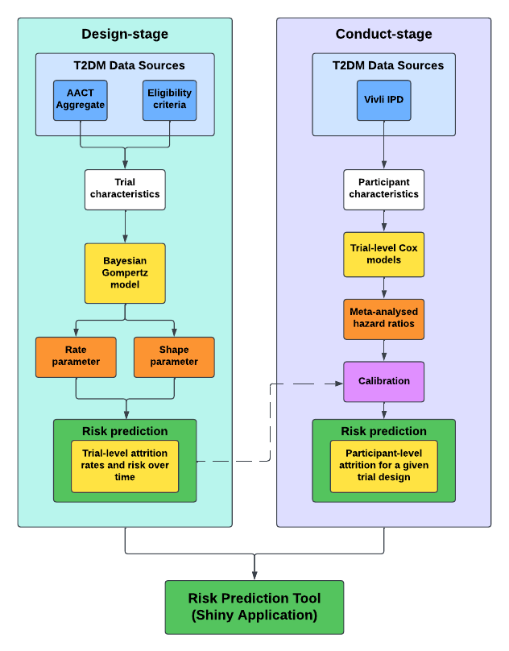

# Protocol: Developing and validating risk prediction models for attrition using participant-level and aggregate-level data from randomised controlled trials for type 2 diabetes mellitus

## Overview
This protocol describes the background, trial selection and intended methodology for developing and validating risk prediction models for attrition using participant-level and aggregate-level data from randomised controlled trials for type 2 diabetes mellitus.

## Background
Randomised controlled trials (hereafter trials) are the gold standard for evidence-based medicine because randomisation allows us to assume exchangeability between treatment groups [1-2]. However, this fundamental design strength and the general validity of trials can be threatened by trial attrition (participant non-completion of a trial for any reason, e.g. adverse events, loss to follow-up). The exchangeability of treatment groups can be disrupted if attrition occurs differently across treatment groups, either by overall occurrence or occurrence among participant subgroups [3]. Both scenarios can introduce attrition bias, a form of selection bias in which trial results reflect the characteristics of participants who completed a trial [4]. Even when these scenarios are avoided, attrition can impact trial validity by reducing statistical power, impacting trial representativeness and ultimately confidence in trial findings [5-6]. 

Attrition is a common and often unavoidable issue in trials. Publicly funded trials typically report between 3-20% attrition [7], while trials published in high impact medical journals report between 1-14% attrition [8]. Greater variation in prevalence and cause is seen among trials of different indications and interventions [9-18]. Given the potential threats to trial validity and prevalence, addressing attrition is a priority area in trial methodology research [19-20]. Yet despite efforts to identify effective retention strategies and to understand factors that influence attrition, it is unclear how attrition can be mitigated in ways that are generalisable to trials. One approach to addressing this would be developing attrition risk prediction models. At the design stage of trials, predicting attrition risk would enable trialists to understand which trial design features influence attrition. This would inform decision making around trade-offs between attrition and other design goals. At the conduct stage of trials, a risk prediction model would allow trialists to examine attrition risk profiles, informing decision making around maximising participant retention. 

We are not aware of any publicly available models for attrition risk prediction. As such, in this protocol, we describe how we will develop and validate attrition risk prediction models for the design and conduct stages of trials. The design stage model will be developed using aggregate-level data and enable predictions of attrition risk and rates based on trial design features (e.g. phase, blinding). The conduct model, developed using both aggregate-level and participant-level data, will enable predictions of individual participant risk profiles in trials with particular design features. We are developing the model using data from trials for type 2 diabetes mellitus because it is a clinical context where little is known about attrition and its impacts.

To inform this protocol, we have conducted an umbrella review examining predictors of attrition [21]. We found no characteristic to be consistently associated with attrition across all trials but identified a number of characteristics included in several studies: participant age, sex and index condition, as well as trial duration, publication/reporting year, sample size and intervention properties (i.e. type, frequency, intensity, delivery and format). We have also conducted an analysis of 90 individual participant data (IPD) trials modelling total attrition rates and attrition rates by category (i.e. Adverse event, lack of efficacy, loss to follow-up, PI/sponsor decision, protocol violation, voluntary withdrawal and other) [22]. These intercept-only models allowed us to identify that change in attrition rates over time frequently followed a Gompertz or log-normal distribution. Based on these findings, we will develop attrition risk prediction models for the design and conduct stages of trials using aggregate-level and participant-level data. 

## Methods
We will develop and validate risk prediction models for attrition in trials for type 2 diabetes mellitus (T2DM). To do this, we will construct design and conduct-stage models. The design stage model will be developed using aggregate-level data and estimate the effects of trial-level covariates on attrition risk, accounting for differences in trial duration. The conduct stage model will be constructed from two sub-models: a participant-level model that estimates the effects of baseline participant characteristics on attrition risk; and the design-stage model with a recalibrated intercept informed by the outputs of the participant-level model. Both models will be internally validated and outputs will be packaged into an attrition risk prediction tool built in R Shiny.

### Data sources
Our research team obtained IPD trials for T2DM in a systematic review and meta-analysis of novel antidiabetics. We have previously described the inclusion criteria and identification for these trials in publication [23-24]. Briefly, eligible trials were phase III or IV trials comparing the efficacy of novel antidiabetics in adults with T2DM in terms of glycaemic control, weight management and/or major adverse cardiovascular events (MACE). We accessed IPD for eligible trials via the Yale University Open Data Access (YODA) and Vivli Centre for Global Clinical Research Data (hereafter Vivli) repositories. For eligible trials without IPD, we accessed trial data via the aggregated analysis of ClinicalTrials.gov database (AACT).

For the current development, from the set of 602 T2DM trials we excluded trials where MACE was the primary outcome because the end of follow-up in MACE trials is ambiguous. We have restricted the remaining trials to those with at least 125 randomised participants (as we found the majority of IPD trials have this sample size) and for which attrition counts could be verified on clinicaltrials.gov or in clinical study reports. For aggregate-level trials, we excluded trials not registered on clinicaltrials.gov and obtained attrition counts from either clinicaltrials.gov or study publications if results are not posted. We have excluded trials that did not compare a newer antidiabetic class to a placebo or an older antidiabetic (i.e. active comparator). Lastly, we have excluded experimental arms to simplify model development.

The final set consists of 415 trials, of which 74 have IPD. The IPD set comprises 17,937 participants, 79 placebo and active comparator arms, a mean follow-up duration of 1.03 years and an attrition event rate of 0.21 (3718 events). The aggregate set consists of 344 trials with 72,065 participants, 361 placebo and active comparator arms, a mean follow-up duration of 0.55 years and an attrition event rate of 0.17 (12,430 events).

### Participants
We have included all randomised participants in the trial set. Eligibility criteria for the individual trials are available at clinicaltrials.gov and will be reproduced on our GitHub repository.

### Data preparation
We have prepared IPD within a secure virtual environment provided by Vivli. Aggregate-level data have been prepared locally using AACT datasets stored in the project GitHub repository. For the IPD trials, we calculated participation times between the dates of randomisation and completion or non-completion. Participation times have been restricted to the protocol-defined duration of follow-up. Completion status has been indexed as a binary event variable. We checked the validity of extractions by comparing counts to participant flow statistics reported on clinicaltrials.gov or in clinical study reports. For aggregate-level trials, we extracted arm-level attrition counts from AACT datasets and study publications. We extracted total follow-up duration for aggregate-level trials because individual follow-up times were not available. We have extracted participant and trial characteristics based on data availability among IPD and aggregate-level trials and the findings of our umbrella review (see Table 1). Code lists, analysis code and detailed definitions will be made available at the project GitHub repository.

For IPD trials, baseline participant characteristics include demography (e.g. age, sex), vital signs (e.g. blood pressure), laboratory measures (e.g. cholesterol), concomitant medications and comorbidities. For concomitant medications, we counted the number of unique medication classes per participant using the World Health Organisation Anatomical Therapeutic Chemical (WHO ATC) classification system (e.g. ATC level/number of characters, e.g. A10BA – Biguanides). For comorbidities, we indexed medical conditions using MedDRA codes in medical history data. We identified the presence of index conditions recommended by Ho et al. to be included in trial reporting of multimorbidity [25].

For the aggregate-level trials, trial design features include eligibility criteria, phase, duration, sample size, number of visits, number of sites and region. Regions have been indexed using country data and based on the WHO member states regions (African region, Region of the Americas, Eastern Mediterranean region, European region, South-east Asia region, Western Pacific region). Our research team previously extracted eligibility criteria.

| Baseline participant characteristics                | Trial characteristics                                   |
|-----------------------------------------------------|---------------------------------------------------------|
| Age (years)                                         | Phase                                                   |
| Sex (male/female)                                   | Eligibility criteria                                    |
| Race/ethnicity                                      | WHO regions involved                                    |
| Current smoker (yes/no)                             | Number of arms                                          |
| Body mass index (kg/m²)                             | Treatment arm                                           |
| Number of concomitant medications                   | Trial size                                              |
| Number of comorbidities                             | Aggregated baseline characteristics (e.g. age, sex, BMI)|
| Duration of type 2 diabetes mellitus (years)        |                                                         |
| HbA1c (%)                                           |                                                         |
| eGFR (mg/dl)                                        |                                                         |
| Total/HDL/LDL cholesterol (mmol/l)                  |                                                         |
| Systolic blood pressure (mmHg)                      |                                                         |
| Diastolic blood pressure (mmHg)                     |                                                         |

*Table 1. Participant and trial characteristics from which candidate predictors will be identified.*

### Sample size
This protocol has been informed by the recommendations of Riley et al. to calculate sample sizes for developing robust clinical prediction models [26]. We have explored how required sample size varies across assumptions about model complexity (i.e. number of predictors), anticipated performance (i.e. R-squared) and outcome prevalence. We used the pmsampsize R package and iterated over different parameter values (performance, parameters, prevalence).

For the participant-level model, we assumed a maximum of 13 predictors (based on characteristics from which candidates will be identified) will be included, a duration of 1 year and a minimum sample size of 541 person-years of follow-up (based on our previous IPD analysis that included 41 T2DM trials with an event rate of 0.15 and mean follow-up of 1 year). With these assumptions, we determined that the anticipated sample size would facilitate robust development by fitting a model with 7 predictors with at least 8.4 events per predictor. For the design model, we assumed a maximum of 20 predictors will be included in model development and a maximum sample size of 362 (the number of placebo and active comparator arms among the 344 aggregate trials). With this, we determined that our anticipated sample size can facilitate robust development by fitting models with 9 predictors with at least 5.5 events per predictor.

### Missing data
We have found missingness to be relatively low among IPD trials. Missingness among baseline characteristics in aggregate trials is considerably greater. As such, we will use multiple imputation to address missing data in both trial sets. For IPD trials, where a variable is partially missing, we will impute missing data using the mice R package. Where a variable is completely missing, we will predict missing values by fitting mixed linear models to trials where the respective variable is not missing. For aggregate trials, we will exclude variables that are completely missing and impute values for partially missing variables using the amelia R package.

### Outcomes
The outcome will be attrition, defined as participant non-completion of a trial for any reason by the end of follow-up as defined in respective trial protocols (see data preparation for details on how the outcome was constructed).

### Model development
The framework for model development is illustrated in Figure 1. We will develop the risk prediction models for the design and conduct stages of T2DM trials. The design-stage model will be developed using aggregate-level data, facilitating predictions of attrition risk and rates over time based on trial design features that account for differences in trial duration. The conduct stage model will be constructed by developing two sub-models: a participant-level model that estimates attrition risk for individual participants based on baseline characteristics, and an aggregate-level model consisting of the design-stage model with a recalibrated intercept using the outputs of the participant-level model.

Model development will be conducted in R (4.3.2 Vienna, Austria) using the survival, glmnet and rstan R packages. Summary statistics, model outputs and scripts written for preparation and development will be made available at the project GitHub repository.

*Figure 1. Overview of model development plan. T2DM = Type 2 diabetes mellitus, IPD = Individual participant data. AACT = Aggregate Analysis of ClinicalTrials.gov. CDF = Cumulative distribution function.*

#### Predictor selection
Predictors will be selected using regularisation techniques. With this, predictors with smaller effect sizes will be shrunk towards zero, promoting model sparsity (i.e. inclusion of a smaller number of predictors with larger effect sizes) and preventing overfitting. This approach will allow us to include all candidate predictors for each model illustrated in Table 1. For the participant sub-model, we will apply LASSO (least absolute shrinkage and selection operator) penalisation using the glmnet R package. Cross-validation will be performed to find the optimal regularisation parameter controlling the degree of shrinkage applied to each predictor coefficient. For the aggregate-level models, we will apply Bayesian regularisation in which each predictor coefficient is modelled with a hierarchical prior comprising a global shrinkage factor and covariate-specific shrinkage factors. This will enable adaptive regularisation to be applied across predictors.

#### Design model
The design-stage model will be constructed using arm-level aggregate data (total number of arm participants and attrition counts) and trial-level covariates, including treatment type. As we previously found that attrition rates can be described using the Gompertz distribution, we can use this information to fit models that can predict attrition rates in the absence of individual event times. We will fit a model similar to that described in NICE Technical Support Document 3 (3.2. Rate data: Binomial likelihood and cloglog link) for modelling rates where event times are not available.

For the model likelihood, we will specify a binomial distribution in which the probability of attrition is a function of the Gompertz cumulative distribution function, with shape (a) and rate (b) parameters. In exploratory work, we have found shape and rate to be moderately correlated, and that rate and some aggregate-level covariates predict shape. As such, we will specify shape as conditional on rate and trial design features. To do this, we will fit a linear model with global-local Gaussian regularisation to shrink non-significant effects towards zero. We will place covariates on rate and specify random intercepts (i.e. baseline log-hazard rate) for each trial. This specification will conserve a hierarchical model structure, with variation supplied for each arm per trial.

We will use global-local regularisation to shrink predictors with smaller effect sizes towards zero, specifying shrinkage parameters and supplying priors for each. The model will be estimated in Stan using Hamiltonian Markov Chain Monte Carlo (MCMC) sampling, running four independent chains with 3000 iterations after burn-in. We will conduct standard posterior checks to evaluate model convergence, predictive error and uncertainty, and summarise effect estimates using the posterior mean and 95% credible intervals.

#### Conduct model
The conduct-stage model will be constructed from developing a participant-level model and the design-stage model. The participant-level model will estimate the effects of baseline participant characteristics on attrition risk. This model will be combined with the outputs of the design model to estimate the combined effect of baseline participant characteristics and trial design features on attrition risk.

For the participant-level model, we will fit trial-level Cox proportional hazard models with the inclusion of participant-level characteristics, and LASSO will be applied to shrink coefficients towards zero. We will test for proportional hazards by calculating Schoenfeld residuals and plotting residuals against time to examine violations (i.e. non-random residual patterns). If we find violations of proportional hazards for any covariate, we will fit parametric survival models to each trial. We will also test for non-linearity among numeric covariates by estimating a smoothed loess curve from covariate values and model residuals. If we find evidence for non-linearity, we will fit the Cox models with fractional polynomials for the respective covariates. We will then export the model results, marginal distributions for covariates as well as covariate correlations from the Vivli environment.

Outside of the environment, we will meta-analyse the trial-level effect estimates to obtain a single set of hazard ratios for baseline participant characteristics. To do this, we will fit a hierarchical Bayesian model using the brms R package with fixed effects for baseline participant characteristics and random slopes and intercepts for each trial. We will estimate the model in Stan using Hamiltonian Markov Chain Monte Carlo (MCMC) sampling, running four independent chains in parallel with 2000 iterations after warmup. We will conduct standard posterior checks and summarise the pooled effect estimates using the posterior mean and 95% credible intervals.

To construct the conduct-stage model we will combine the outputs of the participant-level and design models using calibration-in-the-large. Briefly, calibration-in-the-large is an adjustment method for risk prediction models that aligns the average predicted risk from a model with the observed or expected risk for a given outcome in a target population. This is achieved by updating the model intercept without modifying covariate effect estimates. In our use case, we will calibrate the intercept of the design model to match the expected average attrition risk estimated by the participant-level model. To do this, we will first generate synthetic IPD using the marginal distributions for baseline characteristics obtained from arm-level aggregate-level data, as well as marginal distributions and covariate correlations for baseline characteristics obtained from the IPD trials. Synthetic covariates will be generated via Sobol sequences implemented using the multinma package. Next, we will estimate a linear predictor for each synthetic participant by applying the meta-analysed hazard ratios from the participant-level model. Individual participant risks will then be aggregated to obtain an overall expected attrition rate. We will use backsolving to identify the optimal intercept shift that aligns observed and predicted attrition risk.

For use in the risk prediction tool, we will illustrate predictive uncertainty using Monte Carlo simulation, sampling the coefficients (and intercepts) and variance-covariance matrices for each model from a multivariate normal distribution. For each sample, we will take the product of covariates and sampled coefficients to estimate covariate-specific parameters. This will allow us to estimate attrition rates over a given set of timepoints using the Gompertz hazard function, as well as cumulative incidence and distribution using the respective Gompertz functions.

### Model validation
We will internally validate the design and conduct stage models. For the design-stage model, internal validation will assess discriminatory ability and predictive performance. Discriminatory ability will be evaluated by calculating area under the receiver operating characteristic curve (AUC). Briefly, AUC in this context will quantify the ability of models to distinguish between trials with higher and lower probabilities of attrition. We will compute AUC across posterior samples and report summary statistics, including credible intervals. Predictive performance will be assessed using posterior predictive checks (comparing observed and predicted attrition counts) and the Brier score. The Brier score measures the mean squared difference between predicted and observed outcomes, with lower values indicating better accuracy. Brier scores will be calculated using predicted and observed attrition counts across all arms and by treatment type (i.e. placebo, active comparator).

For the conduct-model, we will assess discriminatory ability and calibration. As with the design model, we will evaluate discriminatory ability using AUC and the Brier score. Calibration will be assessed in terms of overall calibration and calibration slope. We will evaluate overall calibration by plotting observed risks against predicted risks before and after intercept adjustment. Calibration slope will be evaluated by regressing observed risk on the linear predictor constructed for calibration-in-the-large. An estimated slope at or close to 1 will indicate good agreement between observed and predicted risk. Agreement will be assessed visually by generating a plot of the calibration slope.

## Reporting of results
The characteristics of IPD and aggregate-level trials will be presented using summary statistics, including the total number of randomised participants, conditions studied, attrition metrics and the marginal distributions of participant-level and trial-level characteristics. Attrition will be reported as the proportion of randomised participants who did not complete a trial. The stages of model development and validation will be summarised in-text and supported with tables and figures. Complete model information (i.e. specification, parameters, outputs) will be available at the project GitHub repository, along with summary statistics, aggregated development and validation data and scripts written for preparation, model development and validation. The outputs of model development will be deployed in an R Shiny application. We will present the development of this application and showcase applications as a risk prediction tool with case studies.

## Conclusion
In this protocol, we described how we will produce attrition risk prediction models by developing and validating risk prediction models using participant-level and aggregate-level data from trials of T2DM. To our knowledge, this will be the first of its kind in the field of retention research, and we hope its development can support the design and conduct of trials that minimise attrition. The results of development and validation will be interpreted and shared for clinical research purposes in peer-reviewed publications and scientific conferences. The risk prediction tools and preceding outputs from model development and validation will be made publicly available for use in trial design, conduct and methodological research. 

## Declarations
This protocol was developed as part of an MRC-funded PhD project (314123-01). The funder had no role in the conceptualisation, design, data collection, analysis, decision to publish or preparation of the manuscript.
This underlying project was approved by the University of Glasgow College of Medicine, Veterinary and Life Sciences ethics committee (200220327).
Summary statistics, model outputs and scripts will be made available at the project GitHub repository.

## References
1. Hariton E, Locascio JJ. Randomised controlled trials—the gold standard for effectiveness research. BJOG Int J Obstet Gynaecol 2018; 125: 1716 doi: 10.1111/1471-0528.15199.
2. Burns PB, Rohrich RJ, Chung KC. The Levels of Evidence and their role in Evidence-Based Medicine. Plast Reconstr Surg 2011; 128: 305 doi: 10.1097/PRS.0b013e318219c171.
3. Dumville JC, Torgerson DJ, Hewitt CE. Reporting attrition in randomised controlled trials. BMJ. 2006 Apr 22;332(7547):969–71.
4. Nunan D, Aronson J, Bankhead C. Catalogue of bias: attrition bias. BMJ Evid-Based Med. 2018 Feb;23(1):21–2.
5. Heo M. Impact of subject attrition on sample size determinations for longitudinal cluster randomized clinical trials. J Biopharm Stat. 2014;24(3):507–22.
6. Fewtrell MS, Kennedy K, Singhal A, Martin RM, Ness A, Hadders-Algra M, et al. How much loss to follow-up is acceptable in long-term randomised trials and prospective studies? Arch Dis Child. 2008 June 1;93(6):458–61.
7. Jacques RM, Ahmed R, Harper J, et al. Recruitment, consent and retention of participants in randomised controlled trials: a review of trials published in the National Institute for Health Research (NIHR) Journals Library (1997–2020). BMJ Open 2022; 12: e059230 doi: 10.1136/bmjopen-2021-059230.
8. Akl EA, Briel M, You JJ, et al. Potential impact on estimated treatment effects of information lost to follow-up in randomised controlled trials (LOST-IT): systematic review. BMJ 2012; 344: e2809–e2809 doi: 10.1136/bmj.e2809.
9. Fabricatore AN, Wadden TA, Moore RH, et al. Attrition from Randomized Controlled Trials of Pharmacological Weight Loss Agents: A Systematic Review and Analysis. Obes Rev Off J Int Assoc Study Obes 2009; 10: 333–341 doi: 10.1111/j.1467-789X.2009.00567.x.
10. Hui D, Glitza I, Chisholm G, et al. Attrition rates, reasons and predictive factors in supportive and palliative oncology clinical trials. Cancer 2013; 119: 1098–1105 doi: 10.1002/cncr.27854.
11. Oriani A, Dunleavy L, Sharples P, et al. Are the MORECare guidelines on reporting of attrition in palliative care research populations appropriate? A systematic review and meta-analysis of randomised controlled trials. BMC Palliat Care 2020; 19: 6 doi: 10.1186/s12904-019-0506-6.
12. Cooper AA, Conklin LR. Dropout from individual psychotherapy for major depression: A meta-analysis of randomized clinical trials. Clin Psychol Rev 2015; 40: 57–65 doi: 10.1016/j.cpr.2015.05.001.
13. Lewis C, Roberts NP, Gibson S, et al. Dropout from psychological therapies for post-traumatic stress disorder (PTSD) in adults: systematic review and meta-analysis. Eur J Psychotraumatology 2020; 11: 1709709 doi: 10.1080/20008198.2019.1709709.
14. Skea ZC, Newlands R, Gillies K. Exploring non-retention in clinical trials: a meta-ethnographic synthesis of studies reporting participant reasons for drop out. BMJ Open 2019; 9: e021959 doi: 10.1136/bmjopen-2018-021959.
15. Grossi E, Dalle Grave R, Mannucci E, et al. Complexity of attrition in the treatment of obesity: clues from a structured telephone interview. Int J Obes 2006; 30: 1132–1137 doi: 10.1038/sj.ijo.0803244.
16. Sheill G, Guinan E, Brady L, et al. Exercise interventions for patients with advanced cancer: A systematic review of recruitment, attrition, and exercise adherence rates. Palliat Support Care 2019; 17: 686–696 doi: 10.1017/S1478951519000312.
17. Iliakis EA, Ilagan GS, Choi-Kain LW. Dropout rates from psychotherapy trials for borderline personality disorder: A meta-analysis. Personal Disord Theory Res Treat 2021; 12: 193–206 doi: 10.1037/per0000453.
18. Mohseni S, Tabatabaei-Malazy O, Peimani M, et al. Withdrawal reasons of randomized controlled trials on type 2 diabetes: a systematic review. DARU J Pharm Sci 2021; 29: 39–50 doi: 10.1007/s40199-020-00380-7.
19. Brunsdon D, Biesty L, Brocklehurst P, et al. What are the most important unanswered research questions in trial retention? A James Lind Alliance Priority Setting Partnership: the PRioRiTy II (Prioritising Retention in Randomised Trials) study. Trials 2019; 20: 593 doi: 10.1186/s13063-019-3687-7.
20. Tudur Smith C, Hickey H, Clarke M, et al. The trials methodological research agenda: results from a priority setting exercise. Trials 2014; 15: 32 doi: 10.1186/1745-6215-15-32.
21. McChrystal R, Lees J, Gillies K, et al. Participant and trial characteristics reported in predictive analyses of trial attrition: An umbrella review of systematic reviews of randomised controlled trials across multiple conditions. Epub ahead of print 7 June 2024. DOI: 10.21203/rs.3.rs-4378411/v1 doi: 10.21203/rs.3.rs-4378411/v1.
22. McChrystal R, Hanlon P, Lees JS, Phillippo DM, Welton NJ, Gillies K, et al. Modelling rates of trial attrition: An analysis of individual participant data from 90 randomised controlled trials of pharmacological interventions for multiple conditions. J Clin Epidemiol. 2025 Sept 6;111971. doi: 10.1016/j.jclinepi.2025.111971.
23. Butterly E, Wei L, Adler AI, Almazam SAM, Alsallumi K, Blackbourn LAK, et al. Calibrating a network meta-analysis of diabetes trials of sodium glucose cotransporter 2 inhibitors, glucagon-like peptide-1 receptor analogues and dipeptidyl peptidase-4 inhibitors to a representative routine population: a systematic review protocol. BMJ Open. 2022 Oct 1;12(10):e066491. doi: 10.1136/ bmjopen-2022-066491.
24. Hanlon P, Butterly E, Wei L, Wightman H, Almazam SAM, Alsallumi K, et al. Age and Sex Differences in Efficacy of Treatments for Type 2 Diabetes: A Network Meta-Analysis. JAMA. doi: 10.1001/jama.2024.27402
25. Ho ISS, Azcoaga-Lorenzo A, Akbari A, Davies J, Khunti K, Kadam UT, et al. Measuring multimorbidity in research: Delphi consensus study. BMJ Medicine. 2022;1(1). doi: 10.1136/ bmjmed-2022-000247.
26. Riley RD, Ensor J, Snell KIE, Harrell FE, Martin GP, Reitsma JB, et al. Calculating the sample size required for developing a clinical prediction model. BMJ. 2020 Mar 18;m441. doi: 10.1136/bmj.m441.
